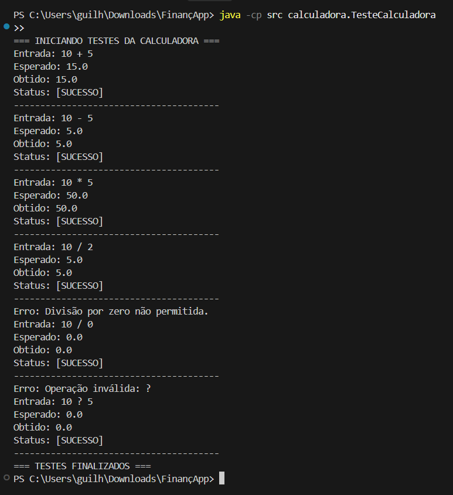
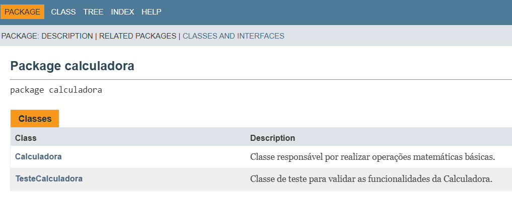

# FinançApp - Módulo de Cálculos Matemáticos

Este projeto faz parte do desenvolvimento do aplicativo **FinançApp**, focado no controle de finanças pessoais. O objetivo é fornecer um núcleo de cálculos matemáticos robusto, testado e documentado.

## Objetivo da Atividade
Desenvolver a capacidade prática na construção, validação, manutenção e documentação de software, aplicando conceitos de:
- Testes Unitários e Funcionais
- Tratamento de Erros
- Refatoração de Código
- Documentação Técnica (JavaDoc)
- Versionamento (Git/GitHub)

## Tecnologias Utilizadas
- **Linguagem:** Java
- **Documentação:** JavaDoc
- **Versionamento:** Git
- **Ambiente:** VS Code / Terminal

## Operações Suportadas
O sistema realiza as quatro operações básicas:
1.  **Soma (+):** Adição de dois valores.
2.  **Subtração (-):** Diferença entre dois valores.
3.  **Multiplicação (*):** Produto de dois valores.
4.  **Divisão (/):** Quociente de dois valores (com proteção contra divisão por zero).

## Execução dos Testes
Os testes validam cenários de sucesso e erro. Para executar:
```bash
javac src/calculadora/*.java
java -cp src calculadora.TesteCalculadora
```

### Resultados Obtidos:


```text
=== INICIANDO TESTES DA CALCULADORA ===
...
```

## Documentação JavaDoc
A documentação técnica foi gerada utilizando o padrão JavaDoc. Você pode encontrá-la na pasta `/docs/index.html`.



### Parâmetros da Classe Calculadora:
- `@author`: Antigravity
- `@version`: 1.1
- `@param a`: Primeiro operando
- `@param b`: Segundo operando
- `@return`: Resultado da operação (double)

## Estrutura de Branches
- `main`: Versão estável inicial.
- `Refatoracao`: Branch contendo o código otimizado, extração de métodos e JavaDoc.

---
Desenvolvido como parte da atividade prática de Qualidade de Software.
